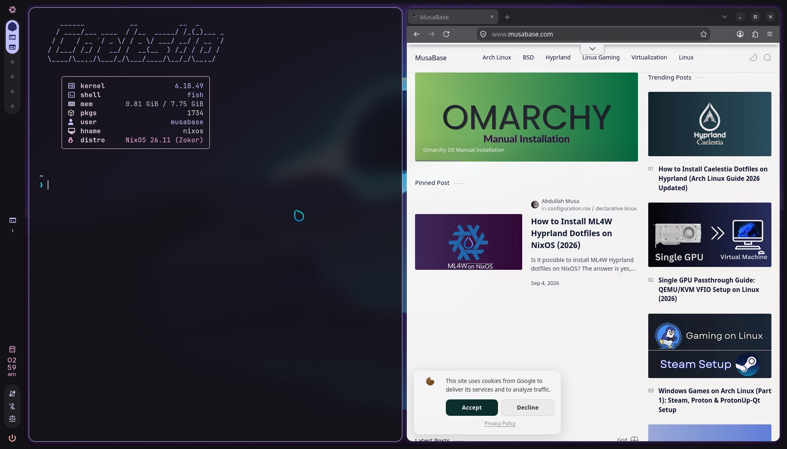
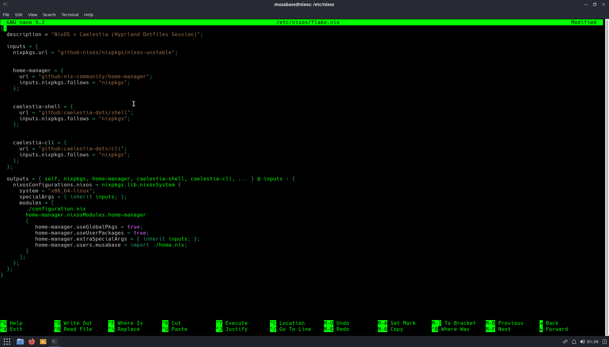
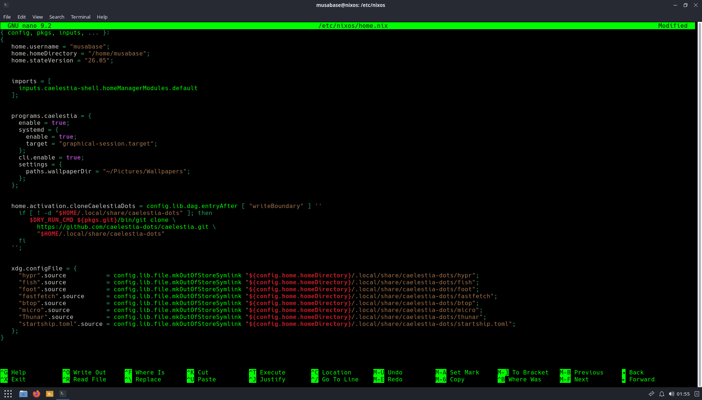
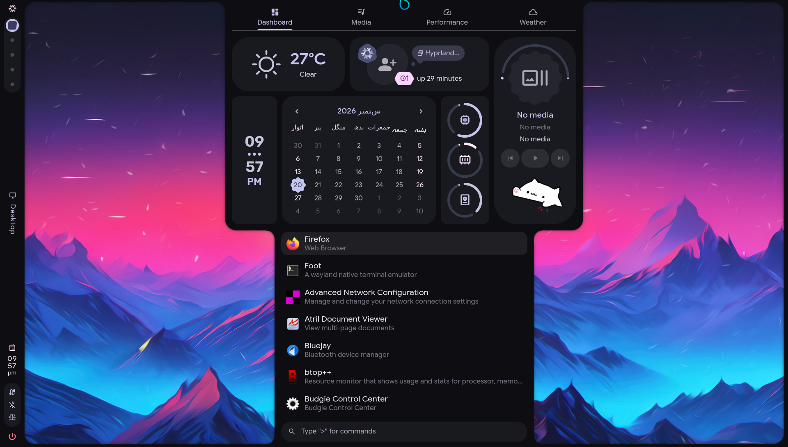

# caelestia-dots-nixos
Manual Caelestia Hyprland dotfiles setup on NixOS using flakes and Home Manager
# Caelestia Hyprland Dotfiles on NixOS

Caelestia's official installer only targets Arch Linux. There's no AUR on NixOS, so this is a manual setup using flakes and Home Manager instead, patching in the Python CLI wheels and C++ dependencies directly rather than relying on the official installer at all.

Full walkthrough with visuals: https://www.musabase.com/2026/09/install-caelestia-dotfiles-on-nixos.html




## 1. Enable flakes

```nix
nix.settings.experimental-features = [ "nix-command" "flakes" ];
```

Add to `/etc/nixos/configuration.nix`, then `sudo nixos-rebuild switch` once, plain, no `--flake` yet.

## 2. System flake (`/etc/nixos/flake.nix`)

```nix
{
  description = "NixOS + Caelestia (Hyprland Dotfiles Session)";

  inputs = {
    nixpkgs.url = "github:nixos/nixpkgs/nixos-unstable";

    home-manager = {
      url = "github:nix-community/home-manager";
      inputs.nixpkgs.follows = "nixpkgs";
    };

    caelestia-shell = {
      url = "github:caelestia-dots/shell";
      inputs.nixpkgs.follows = "nixpkgs";
    };

    caelestia-cli = {
      url = "github:caelestia-dots/cli";
      inputs.nixpkgs.follows = "nixpkgs";
    };
  };

  outputs = { self, nixpkgs, home-manager, caelestia-shell, caelestia-cli, ... } @ inputs: {
    nixosConfigurations.nixos = nixpkgs.lib.nixosSystem {
      system = "x86_64-linux";
      specialArgs = { inherit inputs; };
      modules = [
        ./configuration.nix
        home-manager.nixosModules.home-manager
        {
          home-manager.useGlobalPkgs = true;
          home-manager.useUserPackages = true;
          home-manager.extraSpecialArgs = { inherit inputs; };
          home-manager.users.musabase = import ./home.nix;  # replace with your username
        }
      ];
    };
  };
}
```

`nixosConfigurations.nixos` must match your actual hostname, or `nixos-rebuild` won't find it.





## 3. Add to `configuration.nix`

```nix
programs.hyprland = {
  enable = true;
  xwayland.enable = true;
};

xdg.portal = {
  enable = true;
  extraPortals = [ pkgs.xdg-desktop-portal-gtk ];
};

services.gnome.gnome-keyring.enable = true;
security.polkit.enable = true;

fonts.packages = with pkgs; [
  nerd-fonts.jetbrains-mono
  nerd-fonts.caskaydia-cove
  material-symbols
  rubik
  noto-fonts
  noto-fonts-cjk-sans
  noto-fonts-color-emoji
];

environment.systemPackages = with pkgs; [
  wget git curl
  foot fish thunar starship fastfetch btop micro
  adw-gtk3 papirus-icon-theme papirus-folders
  wl-clipboard cliphist hyprpicker swappy grim slurp
];
```

## 4. Home Manager config (`/etc/nixos/home.nix`)

```nix
{ config, pkgs, inputs, ... }:
{
  home.username = "musabase";              # your username
  home.homeDirectory = "/home/musabase";   # your home directory
  home.stateVersion = "26.05";             # your actual stateVersion

  imports = [
    inputs.caelestia-shell.homeManagerModules.default
  ];

  programs.caelestia = {
    enable = true;
    cli.enabled = true;
  };

  home.activation.cloneCaelestiaDots = config.lib.dag.entryAfter [ "writeBoundary" ] ''
    if [ ! -d "$HOME/.local/share/caelestia-dots" ]; then
      $DRY_RUN_CMD ${pkgs.git}/bin/git clone \
        https://github.com/caelestia-dots/caelestia.git \
        "$HOME/.local/share/caelestia-dots"
    fi
  '';

  xdg.configFile = {
    "hypr".source           = config.lib.file.mkOutOfStoreSymlink "${config.home.homeDirectory}/.local/share/caelestia-dots/hypr";
    "fish".source            = config.lib.file.mkOutOfStoreSymlink "${config.home.homeDirectory}/.local/share/caelestia-dots/fish";
    "foot".source             = config.lib.file.mkOutOfStoreSymlink "${config.home.homeDirectory}/.local/share/caelestia-dots/foot";
    "fastfetch".source        = config.lib.file.mkOutOfStoreSymlink "${config.home.homeDirectory}/.local/share/caelestia-dots/fastfetch";
    "btop".source              = config.lib.file.mkOutOfStoreSymlink "${config.home.homeDirectory}/.local/share/caelestia-dots/btop";
    "micro".source             = config.lib.file.mkOutOfStoreSymlink "${config.home.homeDirectory}/.local/share/caelestia-dots/micro";
    "Thunar".source            = config.lib.file.mkOutOfStoreSymlink "${config.home.homeDirectory}/.local/share/caelestia-dots/thunar";
    "starship.toml".source     = config.lib.file.mkOutOfStoreSymlink "${config.home.homeDirectory}/.local/share/caelestia-dots/starship.toml";
  };
}
```




## 5. Rebuild

```bash
cd /etc/nixos
sudo nix-shell -p git --run "nixos-rebuild switch --flake .#nixos"
```

The `nix-shell -p git` wrapper matters, git isn't guaranteed to exist yet on a fresh system, and flakes need it to fetch inputs from GitHub. Takes 10 to 25 minutes, quickshell compiles from source.

## 6. First login

Reboot, select Hyprland from your login manager's session menu, log in.

Set the color scheme to track your wallpaper dynamically:

```bash
caelestia scheme set -n dynamic
```

Or lock it to one wallpaper:

```bash
caelestia wallpaper -f path_to_wallpaper
```




## Known gotchas

- **"Could not resolve host" during the rebuild**, usually your ISP's default nameserver choking on GitHub or the NixOS cache. Add `networking.nameservers = [ "1.1.1.1" "8.8.8.8" ]; networking.networkmanager.dns = "none";` to `configuration.nix` and rebuild.
- **Rollback**, you don't need anything extra for this. Every `nixos-rebuild switch` creates a new generation, boot into a previous one from GRUB if something breaks.
- **Names will drift.** `caelestia-shell`, `caelestia-cli`, and the home-manager module path are all things upstream can rename. If the flake stops evaluating cleanly, check the current repo structure before assuming your config is wrong.

Full guide, screenshots, and troubleshooting: https://www.musabase.com/2026/09/install-caelestia-dotfiles-on-nixos.html
